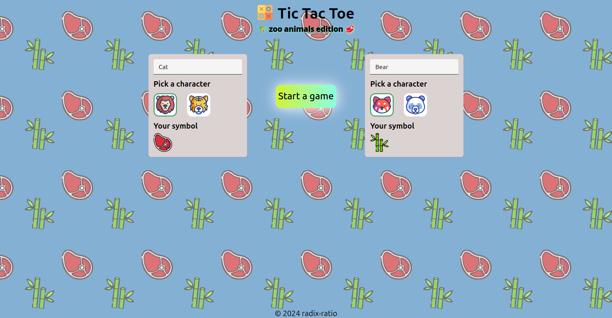

# JavaScript Tic Tac Toe

A simple JavaScript Tic Tac Toe game built with Node.js, created as part of The Odin Project's Node Path curriculum.

## Description

This project is a basic implementation of the classic Tic Tac Toe game, allowing two players to play against each other. The game includes features for creating a game board, making moves, and determining the winner.

## Features

* Create a 3x3 game board
* Allow two players to make moves
* Determine the winner of the game
* Handle invalid moves and game over conditions
## Demo

[**Live Demo**](https://radix-ratio.github.io/tic-tac-toe) | [**Project Specs**](https://www.theodinproject.com/lessons/node-path-javascript-tic-tac-toe)

## Screenshots

## Getting Started

1. Clone the repository to your local machine.
2. Open the `index.html` file in a web browser to run the application.

## License

This project is licensed under the MIT License. See [`LICENSE`](https://choosealicense.com/licenses/mit/) for details.

## Acknowledgments

- The Odin Project for providing the curriculum and resources
- The Flaticon for providing the icons
- The Patterninja for providing background pattern

## Authors

- [@radix-ratio](https://www.github.com/radix-ratio)